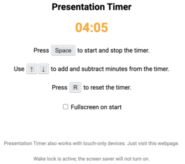

# Presentation Timer

A browser based timer useful mainly for presentations. It provides a simple uncluttered interface that is controlled either by a couple of keyboard keys or touchscreen gestures. It requires a fairly modern browser as it uses HTML5's fullscreen API.

When using browsers that support the [wake lock API](https://developer.mozilla.org/en-US/docs/Web/API/WakeLock), the screen saver will not engage.

### Usage

You can either use the version hosted on GitHub Pages or download it locally for offline use.

- Visit [this webpage](http://dcervenkov.github.io/presentation-timer)
- Or download the four files (`index.html`, `timer.js`, `wakelock.js` and `style.css`) to any local folder and open `index.html` in a browser
